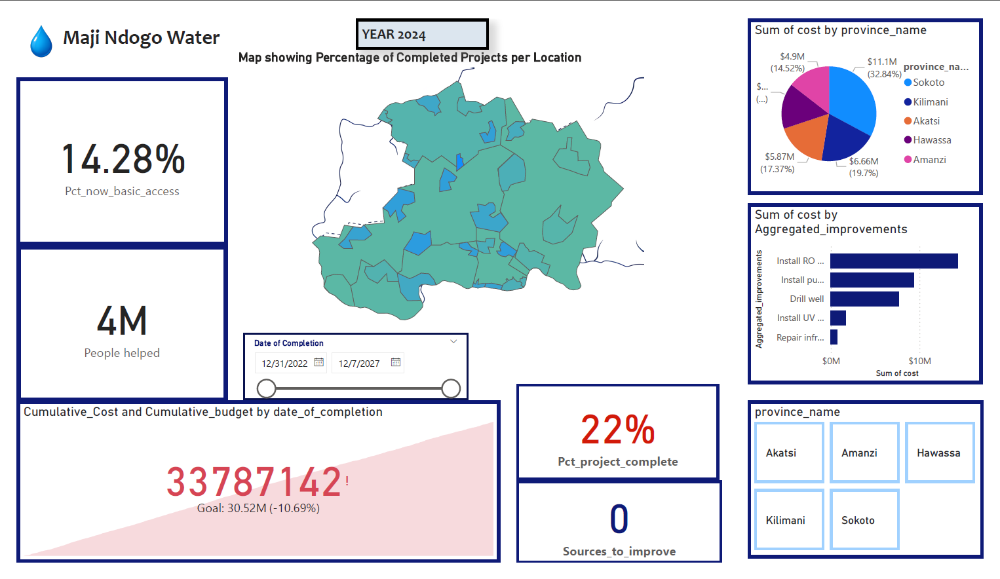
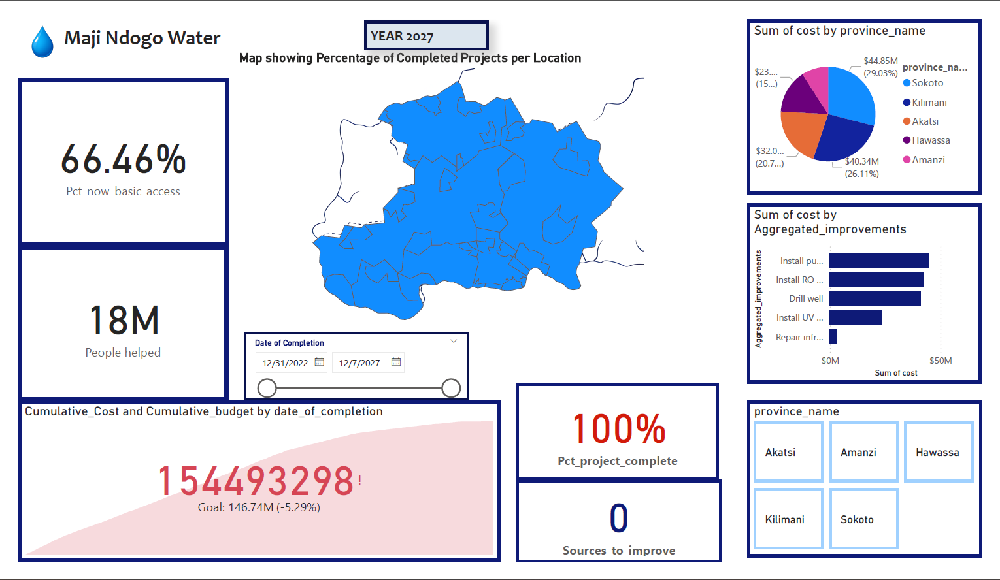
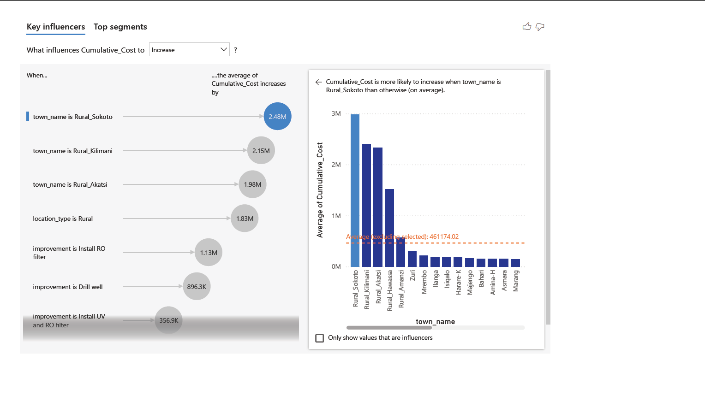
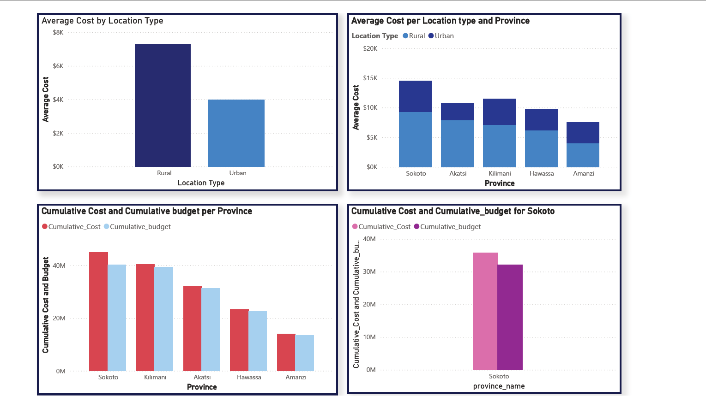
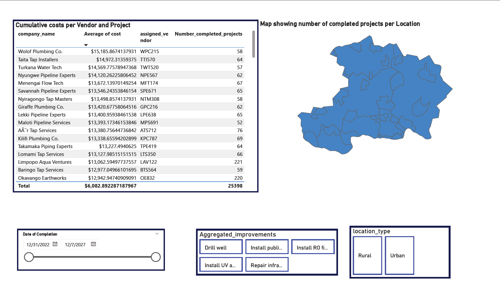

# Restoring-water-access-Visualization-part-4
Transparency in tracking Maji Ndogo's water funds
## Maji Ndogo Water Source Improvement Project – Dashboard Summary

### Table of Contents

- [Project Overview](#project-overview)
- [Data Sources](#data-sources)
- [Exploratory Data Analysis (EDA)](#exploratory-data-analysis-eda)
- [Data Analysis Steps](#data-analysis-steps)
- [Insights](#insights)
- [Summary and Recommendation](#summary-and-recommendation)

### Project Overview
The Maji Ndogo initiative was launched to enhance water access in both rural and urban areas through comprehensive upgrades to water infrastructure. Local vendors, vetted and trained, were contracted to execute improvements including drilling wells, installing purification systems, and extending tap access. The initiative prioritizes transparency and accountability through a centralized dashboard designed to support public engagement and decision-making.

### Data Sources

- **Final Dataset**: [`Md_water_services_data.xlsx`](Md_water_services_data-2027.xlsx) – includes updates up to **2027**, with all project completions recorded.

### Exploratory Data Analysis (EDA)

The following guiding questions were explored during the EDA phase:

1. **How many water source improvement projects were initiated and completed?**
2. **What is the geographical distribution of the projects (by town, province, urban vs rural)?**
3. **What types of improvements were most common (e.g., drilling, purification, taps)?**
4. **How do improvement costs vary by location and type?**
5. **How much time do projects typically take from start to completion?**
6. **Which vendors completed the most and least projects?**
7. **Are there early signs of budget overruns or delays by region or team?**
8. **What percentage of the population had access to basic water before and after improvements?**

### Data Analysis Steps
1. Computed total number of improvements and tracked project completion over time.
2. Analyzed cumulative budget vs actual cost at national and regional levels.
3. Calculated population with basic access to clean water post-intervention.
4. Identified cost variations by location type (urban/rural) and improvement type.
5. Evaluated vendor performance and efficiency based on project delivery and cost.
6. Explored key influencers affecting cost overruns and project timelines.

### Insights

 

 

 

 

 

- ✅ **Project Completion**: In 2024 number of completed projects were 5,488 and by 2027, 25,398 projects which were **100% of targeted projects** were successfully improved.
- 💧 **Access to Water**: **Basic water access improved from 0% in 2023 to 14.28% in 2024 then to 66.46% by 2027** nationwide, significantly reducing reliance on unsafe sources.
- 💸 **Budget Performance**: Although the project experienced a **10–15% budget overrun** mid-way (e.g., in Sokoto), final costs aligned more closely with revised projections by project end.
- 🗺️ **Regional Disparities**:
  - **Sokoto** and **Kilimani** had **highest average costs**, driven by difficult terrain and scattered rural populations.
  - **Urban improvements** were more cost-effective and quicker to complete than rural ones.
- 🧰 **Vendor Insights**:
  - Teams like **Entebbe RO Installers (ERI893)** proved highly efficient by clustering projects geographically, completing the most projects with competitive cost per unit.
  - High-cost vendors like **MBS605** operated in challenging, remote areas costly, but necessary.
- 📈 **Operational Efficiency**:
  - Vendors who minimized travel time and picked up projects near their previous sites completed more work and helped reduce overall costs.
  - The key to efficiency was not always the cheapest vendor but the smartest routing and task clustering.

### Summary and Recommendation
The Maji Ndogo project achieved full completion by 2027, significantly improving access to clean water across all regions. Despite initial budget strains, efficient vendor operations and strategic resource allocation helped deliver on objectives. Moving forward:

- **Continue monitoring vendor behavior** to reinforce efficient practices.
- **Apply lessons from this project** to future infrastructure initiatives, especially regarding rural deployment planning.
- **Use the final dashboard** to communicate the project’s success to the public and funding partners.
- **Share success stories** like that of Entebbe RO Installers to encourage best practices industry-wide.

- The data-driven approach ensured transparency, optimized spending, and brought real change to communities across Maji Ndogo.
